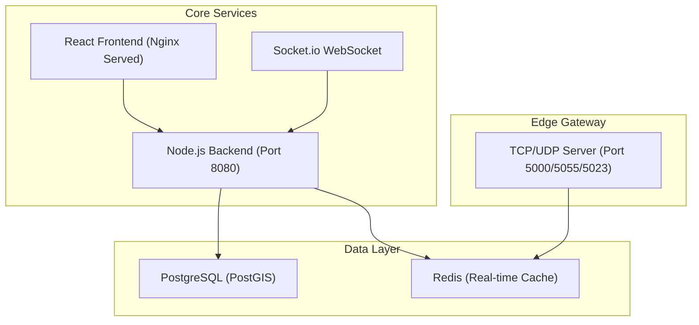

# GeoSurePath — Premium GPS Vehicle Tracking SaaS


A high-performance, executive-grade GPS vehicle tracking platform featuring a unified design system, real-time telemetry, and advanced fleet control.

---

## 💎 Premium Features
- **Executive Dashboards**: High-contrast, standardized UI for both Clients and Admin.
- **Premium Mesh Layer**: Live vehicle tracking with satellite imagery as default.
- **Detailed Playback**: Historical data with Stop status recognition (Ignition OFF) and speed analysis.
- **Operations Center**: Comprehensive admin control over clients, hardware (IMEI), and protocols.
- **Kinetic Override**: Remote engine cut/resume and speed limit configuration.
- **Auto-Archiving**: Telemetry older than 90 days moved to Google Drive archives.

---

## 🏗️ Technical Architecture



---

## 🔐 Master Access

| Component | Default Value | Notes |
|-----------|---------------|-------|
| Admin Portal | `admin@geosurepath.com` | Password: `admin@123` |
| Client Portal | [User Defined] | Create via Registration |
| API Base | `http://3.108.114.12` | Frontend API endpoint |
| WS Base | `ws://3.108.114.12` | Frontend WebSocket endpoint |
| TCP Server | `3.108.114.12:5000` | Device listens here |
| GT06 Gateway (TCP) | PORT 5023 | High Precision Protocol |

---

## 🛠️ Production Environment Variables

Edit `backend/.env` after deployment:

```env
POSTGRES_USER=gps_admin
POSTGRES_PASSWORD=your_secure_password
POSTGRES_DB=gps_saas
DB_HOST=db
REDIS_HOST=redis
JWT_SECRET=your_jwt_secret
NODE_ENV=production
ADMIN_EMAIL=admin@geosurepath.com
ADMIN_PASSWORD=admin@123

# Integration
SMTP_HOST=smtp.gmail.com
SMTP_PORT=587
SMTP_USER=your_email
SMTP_PASS=your_app_password
TWILIO_ACCOUNT_SID=AC...
TWILIO_AUTH_TOKEN=...
GOOGLE_BACKUP_FOLDER_ID=1xR_DVXjm78URhz9gnbkOM1ERLARM-wN8
```

---

## 🚀 Deployment Guide (AWS Lightsail)

The system is optimized for **AWS Lightsail 2GB RAM** instances.

### 1. Execute One-Click Installer
```bash
sudo bash install.sh
```
*This script automatically handles swap creation, docker installation, firewall configuration, and Nginx proxying.*

### 2. Verify Services
```bash
docker-compose ps
```

### 3. Setup SSL (Recommended)
```bash
sudo apt install certbot python3-certbot-nginx
sudo certbot --nginx -d yourtrackingserver.com
```

---

## 📁 Repository Structure
- `/frontend`: React + Premium UI Components
- `/backend`: Node.js Core API & Worker Services
- `/tcp-server`: Binary GPS Protocol Parsers
- `/database`: Schema and Migrations
- `install.sh`: Master Deployment Script

---

## ☁️ Archiving & Retention
Data older than 90 days is automatically archived to the following directory:
[Historical Archives](https://drive.google.com/drive/folders/1xR_DVXjm78URhz9gnbkOM1ERLARM-wN8)
